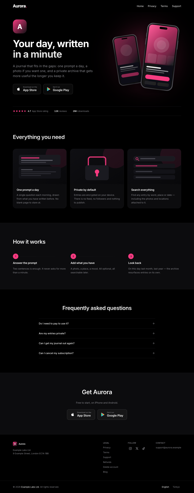

# App Landing Template

A **deploy-artifact production line** for mobile app landing pages. This is not a website
project: the metric being optimised is time-to-launch for a new app.

**A new app = one config file + one asset folder + one DNS record.**

Full architectural rationale: [`docs/landing-template-spec.md`](docs/landing-template-spec.md)

<p align="center">
  
</p>

<p align="center"><em>Every word, image and link above comes from one config file.</em></p>

---

## What the site is for

The growth channel for these apps is paid UA (Meta/TikTok) plus ASO. Conversion happens on
the App Store / Play side, not on the web. So the site is not a marketing asset — it is a
mandatory surface that does exactly three jobs:

1. The marketing, support, privacy, and account-deletion URLs the App Store and Play require
2. Routing an ad click on the web to the right store or deep link (attribution)
3. A professional web presence for business verification

Job 2 is the one with the most machinery behind it — see
[Marketing and attribution](#marketing-and-attribution).

## Structure

```
packages/landing-kit/   # shared core — config schema, components, SEO, legal templates
apps/multi/             # multi-domain, host -> tenant resolution. Default home for new apps
apps/aurora/            # graduated app example — its own deploy, the same landing-kit
```

Stack: pnpm workspace + Turborepo, Next.js 16 (App Router), React 19, TypeScript, Tailwind v4.
Deploy: Vercel. No CMS — the config file is the single source of truth.

## Getting started

```sh
pnpm install
pnpm --filter multi dev        # http://aurora.localhost:3100
                               # http://atlas.localhost:3100
```

`{slug}.localhost` is mapped automatically by the tenant registry.

One deploy serves every tenant. `abc.ai` and `def.ai` can be two tenants of the same
`apps/multi` deploy — the `Host` header picks which config renders, and each domain gets its
own canonical, sitemap, OG image, and deep-link files. A host the registry does not know
returns 404.

## Commands

```sh
pnpm check                     # typecheck + lint + unit tests
pnpm --filter multi build
pnpm --filter multi test:e2e   # Playwright — verifies the acceptance criteria
```

## Adding an app

```
1.  apps/multi/config/{slug}.ts     write the config, add it to config/index.ts
2.  apps/multi/public/apps/{slug}/  drop in icon, logo, mockup
3.  git push                        Vercel builds on its own
4.  Vercel -> Domains               add myapp.com and www.myapp.com, once
```

No new Vercel project, no deploy command, no environment variable, no code.
`NEXT_PUBLIC_DEFAULT_TENANT` is not per app — it only decides who the `*.vercel.app` URL shows.

Full detail in [docs/adding-a-tenant.md](docs/adding-a-tenant.md).

### Staying current with the template

"Use this template" creates a repo with no shared history, so `git pull` has nothing to merge.
Add this repo as a remote and cherry-pick the fixes you want — see
[docs/updating-from-the-template.md](docs/updating-from-the-template.md).

## Runbooks

- [Launching a new app](docs/adding-a-tenant.md)
- [Deploying](docs/deploy.md)
- [Pulling template updates into your repo](docs/updating-from-the-template.md)
- [Moving an app to its own deploy (graduation)](docs/graduation.md)
- [AGENTS.md](AGENTS.md) — invariants, gotchas and task recipes for coding agents

## Marketing and attribution

Every store link on the site goes through `/go/...` rather than to the store directly. That one
rule is what makes the rest of this work.

```
Meta ad  →  myapp.ai/?utm_source=meta&utm_campaign=summer
                ↓  visitor reads the page, taps a badge
         →  /go/hero?store=ios&utm_source=meta&utm_campaign=summer
                ↓  the route reads the device and builds the destination
         →  OneLink  pid=meta  c=summer  →  App Store
```

The campaign survives both clicks. That matters more than it sounds: an ad almost always points
at the page rather than at `/go/...`, because the point is that people read it before they
convert — and a badge that dropped the query string it was standing on would record every paid
install as organic.

**A new link needs no deploy.** `/go/{source}/{campaign}/{creative}` reads its attribution out
of the path, so a new creator, podcast or flyer is a URL someone types:

```
/go/alice                    campaign "alice"
/go/influencer/alice         source "influencer", campaign "alice"
/go/influencer/alice/reel1   ... and creative "reel1"
```

`campaigns` in the config only overrides what a path already says — for renaming a campaign, or
keeping a creative code out of a URL people will see. Short aliases like `/download` are config
redirects, so what you print on a flyer and what you measure are the same link.

| | Config | Notes |
|---|---|---|
| **Install attribution** | `attribution.oneLink` | AppsFlyer. `utm_*` are mapped onto `af_*`; a real ad click's parameters win over the path |
| **Meta / TikTok / Google Ads pixels** | `attribution.metaPixelId`, `tiktokPixelId`, `googleAdsId` | None load before consent is granted |
| **Web analytics** | `features.analytics` | Vercel, cookieless and first-party, so it needs no banner |
| **Consent banner** | — | Appears only when a pixel is configured. A tenant with none never shows one |
| **Deep links into the app** | `store.ios.teamId` + `bundleId`, `android.sha256Fingerprints` | AASA and assetlinks are generated from these |

Desktop is handled rather than ignored: a store link is a dead click on a laptop, so the route
sends the visitor to the store's web page — or renders a QR code, with `features.desktopQr`.

**Not built yet:** the pixels report a page view but no conversion event, so an ad platform
optimises on "landing page view" rather than "went to the store". The right event name depends
on how your ad account defines conversions, which is why it is not guessed here.

## Ready when you need it

Three things the spec deliberately leaves off by default, built so they can be switched on per
tenant without touching anything but a config file:

| | How it turns on | What it costs when off |
|---|---|---|
| **Extra languages** | `i18n.locales` in the config | Nothing — one locale, no prefix |
| **Blog / content SEO** | `features.blog = true` + Markdown files under `content/` | Routes 404, nothing in the sitemap |
| **Real store screenshots** | Drop the file in `public/apps/{slug}/` | Dimensions are read from the file; no config entry |

The default locale stays unprefixed (`myapp.ai/privacy`), so adding a language never invalidates
a URL already filed with the App Store. Every localised field falls back on its own, and legal
documents that have no translation serve the default language with a notice instead of claiming
an `hreflang` they cannot deliver.

## Before you ship a tenant

The demo tenants (`aurora`, `atlas`) are fictional and exist to exercise the template. Two
things in them must be replaced before anything goes live:

- **`legal.*`** — `Example Labs Ltd`, the placeholder address, `companyUrl` and `governingLaw`
  all end up verbatim in the generated privacy policy, terms and refund pages. The legal
  documents in `packages/landing-kit/src/legal/en/` are a **starting point, not legal advice**;
  have a lawyer review them for your jurisdiction and your app's actual data handling.
- **`store.rating` / `reviewCount`** — the demo values are invented. They are published as
  `aggregateRating` in structured data, and shipping numbers you cannot substantiate breaches
  Google's structured data policy. Use your real store figures or omit both fields.

## Deliberately not built

These are out of scope on purpose; no door is left ajar for "we'll add it later":

- The blog/content engine is off by default (opened per-tenant with `features.blog`)
- No CMS integration
- No programmatic landing page generation
- No multiple CTAs — one device-detected button
- No hand-written `robots.txt` / `sitemap.xml`
- No pixel loading without consent
- Fonts are self-hosted only when the licence clearly allows it (SF Pro is not copied)
